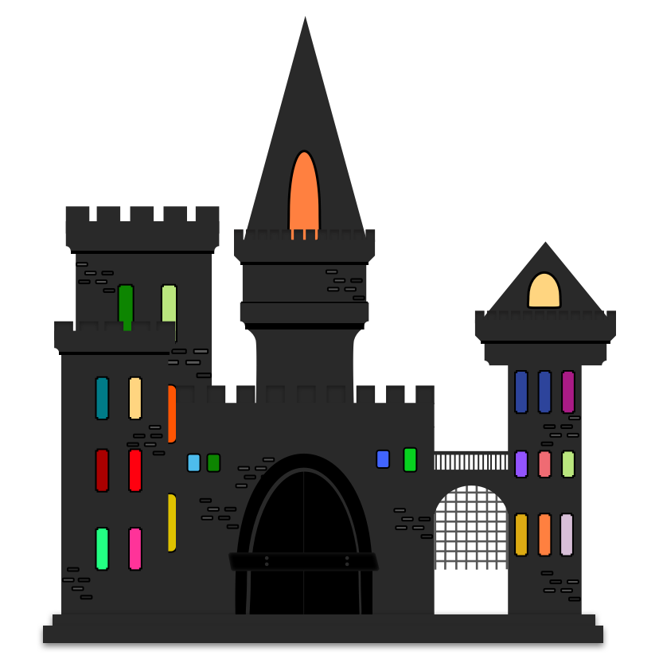
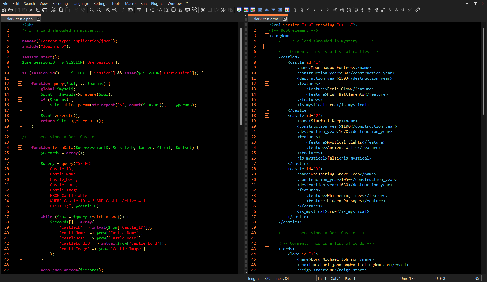

    

<h1 align="center">Dark Castle for     
    <a href="https://notepad-plus-plus.org/" target="_blank">
    Notepad++
    </a>
</h1>

  A vibrantly elegant dark theme available for multiple platforms. Inspired by the timeless beauty and mystery of medieval castles, this theme combines rich, deep colors with a clean and modern design.

## Install

All instructions can be found in the included [Install](INSTALL.md) file.

## Team

This theme is maintained by the following person(s).

|  |  |
| ---------------------------------------------------------------------------------------- | ----------------------------------------------------------------------------------- |
| [Scott Griv](https://github.com/scottgriv)                                               | [Anya E.](https://github.com/anyaenko)                                              |

## Contributing

If you'd like to contribute to this theme, please read the [Contributing Guidelines](https://github.com/scottgriv/Dark-Castle-Theme/blob/main/.github/CONTRIBUTING.md).

## Changelog

Please refer to the [Changelog](.github/CHANGELOG.md) file in this repository for updates, changes, and more detailed information about the project.

## Additional Information

- [Main GitHub Repository](https://github.com/scottgriv/Dark-Castle-Theme)
- [Visit our Website](https://darkcastle.netlify.app/)

## License

[MIT License](./LICENSE)
